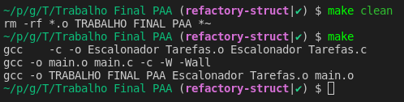

### Problema do Auditório

- Dada uma lista de tarefas a serem executadas com um horário de início e um horário de término, determinar qual a quantidade máxima de atividades que podem ser executadas
- Um auditório só pode ser utilizado para um evento por vez. Em um dia com muitos eventos, deseja-se determinar qual é o maior número de eventos que podem ser realizados no auditório, e quais são eles (OBS: pode haver mais de uma solução).

- Imagine o seguinte quadro de reservas

| Evento  | 1 | 2  | 3 | 4 | 5  | 6  | 7 | 8  | 9 | 10 | 11 |
|---------|---|----|---|---|----|----|---|----|---|----|----|
| Inicio  | 3 | 8  | 5 | 1 | 6  | 12 | 0 | 8  | 5 | 2  | 3  |
| Término | 5 | 11 | 7 | 4 | 10 | 14 | 6 | 12 | 9 | 13 | 8  |

- Para encontrar o tamanho de um subconjunto sem sobreposição máximo, poderiamos utilizar:

#### Solução gulosa
- Ordenamos os eventos pelo horário de término (em ordem crescente) e sempre que possível pegamos o evento com menor horário de término.


### Dependencias
- [linux](https://www.linux.org/pages/download/)
- [GCC](https://gcc.gnu.org/install/index.html)
- [make](https://www.unixmen.com/install-ubuntu-make-on-ubuntu-15-04/)

### Como buildar
- Para buildar você deve criar ou modificar o `main.c` no root do projeto

- Execute o comando `make`
__Resultado Esperado__



- Deve gerar o arquivo executável `TRABALHO_FINAL_PAA`

### Como Executar
- Após realizar o build do executável com `make`
- Rode o arquivo com a seguinte linha de comando
```shell
./TRABALHO_FINAL_PAA
```

> Para limpar, realizar o build e executar o main use `make run`

### Como Limpar
- Limpa todos os `.out` e o `TRABALHO_FINAL_PAA`
- Execute o comando `make clean`

### Script de dados
- Rode `make script.sh`
- Deve excutar 1000 vezes para cada um dos seguintes valores: `[10 100 1000 10000 100000 1000000 10000000]`