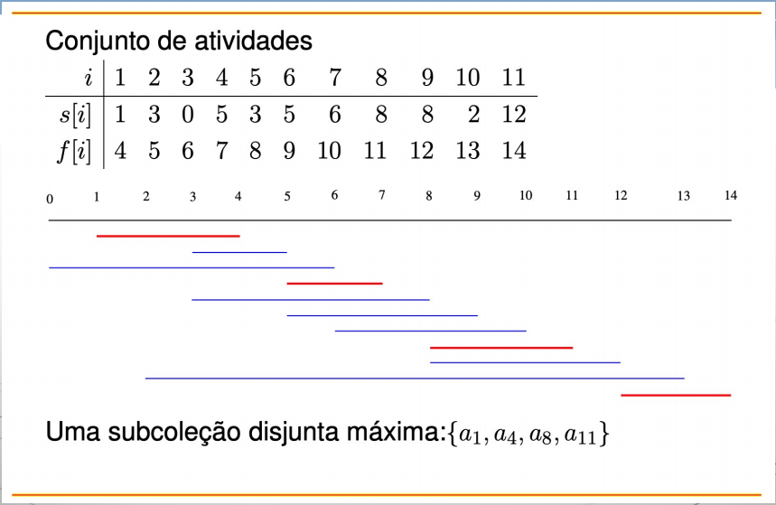
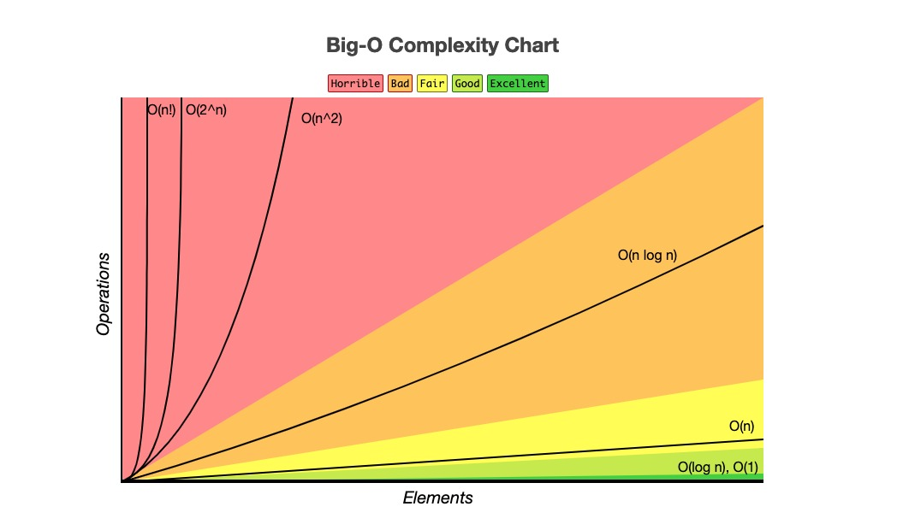
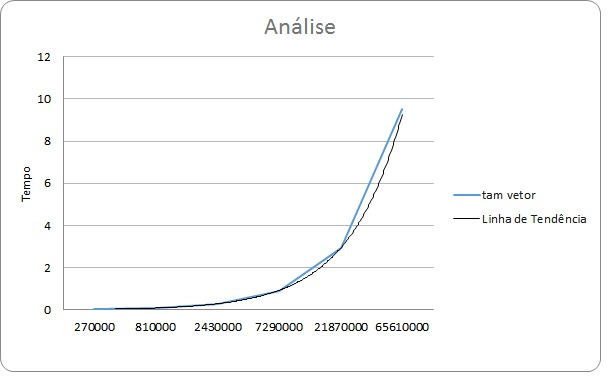
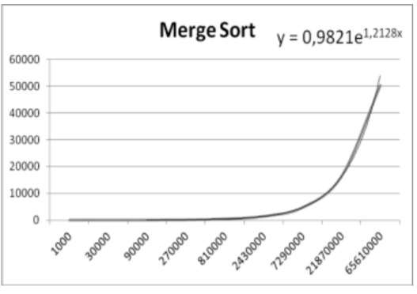

```{r setup, include=FALSE}
knitr::opts_chunk$set(echo = TRUE)
data.csv <- read.csv(file = '../../assets/data_size_2.csv', sep = ';')
```

### Problema do Auditório

- Dada uma lista de tarefas a serem executadas com um horário de início e um horário de término, determinar qual a quantidade máxima de atividades que podem ser executadas
- Um auditório só pode ser utilizado para um evento por vez. Em um dia com muitos eventos, deseja-se determinar qual é o maior número de eventos que podem ser realizados no auditório, e quais são eles (OBS: pode haver mais de uma solução).

- Imagine o seguinte quadro de reservas

| Evento  | 1 | 2  | 3 | 4 | 5  | 6  | 7 | 8  | 9 | 10 | 11 |
|---------|---|----|---|---|----|----|---|----|---|----|----|
| Inicio  | 3 | 8  | 5 | 1 | 6  | 12 | 0 | 8  | 5 | 2  | 3  |
| Término | 5 | 11 | 7 | 4 | 10 | 14 | 6 | 12 | 9 | 13 | 8  |

- Para encontrar o tamanho de um subconjunto sem sobreposição máximo, poderiamos utilizar:

#### Solução gulosa
- Ordenamos os eventos pelo horário de término (em ordem crescente) e sempre que possível pegamos o evento com menor horário de término.




## Relatório de execução e analise de gráficos


- Foram realizadas execuções com vetores de tamanho `270000, 810000, 2430000, 7290000, 21870000 e 65610000`. 
Sendo estes valores limitados pela capacidade e quantidade de hardware disponível.

#### Hardware Utilizado

- 32 GB de memória RAM
- Processador de ryzen 9 5900X, de 12 núcleos e 24 threads


#### Execuções

- Para cada tamanho de vetor descrito anteriormente foram realizados 30 testes, com o intuito de obter maiorgarantia da confiabilidade dos dados. 

- Os dados obtidos nas execuções foram agrupados e realizado a média dos valores, conforme dispostos abaixo. 
```{r}
(data.agg = aggregate(TIME ~ SIZE, data = data.csv, FUN = mean))
```

### Verificando o nível de confiança dos dados obteve-se o seguinte:

- Para testar se os dados gerados são confiáveis, foi utilizado o shapiro test, uma breve explicaçao foi retirada da documentação:

### [Shapiro-Wilks Normality Test](https://variation.com/wp-content/distribution_analyzer_help/hs141.htm)

- The Shapiro-Wilks test for normality is one of three general normality tests designed to detect all departures from normality.  It is comparable in power to the other two tests.

- The test rejects the hypothesis of normality when the p-value is less than or equal to 0.05.  Failing the normality test allows you to state with 95% confidence the data does not fit the normal distribution.  Passing the normality test only allows you to state no significant departure from normality was found.

- The Shapiro-Wilks test is not as affected by ties as the Anderson-Darling test, but is still affected.  The Skewness-Kurtosis All test is not affected by ties and thus the default test.     

```{r}
(data.agg.shapiro = shapiro.test(data.csv$TIME))
percentageConfiance = (1 - data.agg.shapiro$p.value) * 100
```

- __O teste apreenta um p-value próximo de: `r round(data.agg.shapiro$p.value, 4)` o que torna válido um nível de confiança de aproximadamente até: `r round(percentageConfiance, 2)` %__


### Análise dos gráficos 

- Os gráficos foram gerados utilizando-se de duas ferramentas, no R Studio e no Excel. 

- A imagem abaixo apresenta o gráfico plotado na ferramenta R Studio com a relação do tempo de execução versus tamanho do vetor. 
```{r}

plot(data.agg$SIZE, data.agg$TIME, type = "b", col="GREEN", xlab="Tamanho do Vetor", ylab="Tempo de Execução", main="Tempo x Tamanho")
```


#### Demais gráfico dos tempos obtidos
- Bloxplot
```{r}
boxplot(data.csv$TIME, horizontal = T)
#plot(ecdf(data.csv$TIME))
#hist(data.csv$SIZE / data.csv$TIME, col = "GREEN", breaks=100)
```


- Dessa forma, constata-se que a linha traçada segue a curvatura esperada para uma função de `n log n`. Conforme mostrado pela figura abaixo. 



- A linha de tendência foi plotada em outro gráfico, devido as escalas não condizerem com a realidade. Não sendo possível unir os dados para que estes fossem gerados no mesmo gráfico. Já que as escalas da função `n log n`, com base nos tamanhos dos vetores  gerados serem grandes e a execução do programa se realizar de maneira muito rápida, as duas escalas não são compatíveis e não estão no mesmo intervalo. Assim, a linha de tendência para a função `n log n` gerada no R studio é apresentado a seguir. 

```{r}
curve(x * log2(x), from=min(data.agg$SIZE), to=max(data.agg$SIZE), n = length(data.agg$SIZE), type = "b",  col="BLACK")
```


- De maneira, a complementar o entendimento a respeito dos dados obtidos, um novo gráfico foi gerado na ferramenta Excel e está adicionado abaixo. 



- Por este é possível constar que ele segue a curvatura de uma função de merge, conforme o gráfico posterior a ele, que utilizamos como referência. 



- Segundo o autor deste mesmo exemplo, a linha de tendência utilizada para analisar este tipo de gráfico é do tipo "exponencial", a qual sugere o comportamento `O (n log n)`. Assim, a linha de tendência e a linha dos dados podem ser visualizados no mesmo gráfico. 


```{r, include=F}


data.agg

data.agg.sd = sd(data.agg$TIME)

a = 1 - 0.99

(data.agg.shapiro = shapiro.test(data.agg$TIME))
str(data.agg.shapiro)
a > data.agg.shapiro$p.value


str(data.agg)
str(data.csv)

NlogN = function(size) {
  log2(size) * size
}

nLogN = data.agg$SIZE * log2(data.agg$SIZE)
#nLogNTime = data.agg$SIZE * log2(data.agg$SIZE)

#interaction.plot(data.agg$SIZE, data.agg$TIME)
plot(data.agg$SIZE, data.agg$TIME, type = "b", col="RED")
#lines(nLogN, data.agg$TIME, type = "b", col="blue")
curve(x * log2(x), from=min(data.agg$SIZE), to=max(data.agg$SIZE), n = length(data.agg$SIZE), type = "b", add=TRUE, col="BLACK")
#lines(x, y2, pch = 18, col = "blue", type = "b", lty = 2)
curve(x * log2(x), from=min(data.agg$SIZE), to=max(data.agg$SIZE), n = length(data.agg$SIZE), type = "b",  col="BLACK")
data.agg$SIZE
```